# Data Platform - Banco Digital

## Objetivo
Construção de uma arquitetura de dados com modelo Medallion (RAW, TRUSTED, REFINED), ingestão via API e visualização em dashboard.

A proposta é demonstrar, de forma prática, como estruturar ingestão, transformação e consumo de dados com foco em geração de valor para o negócio.

---

## Arquitetura

```mermaid
flowchart LR
    A[API Banco Central] --> B[Python Ingestion]
    B --> C[RAW_SELIC]

    C --> D[Tratamento SQL]
    D --> E[TRUSTED_SELIC]

    E --> F[Agregações / Métricas]
    F --> G[REFINED_SELIC]

    G --> H[Export CSV]
    H --> I[Dashboard HTML]

    style C fill:#1f2937,color:#fff
    style E fill:#374151,color:#fff
    style G fill:#4b5563,color:#fff
```

---

## Tecnologias utilizadas

- Python (ingestão de dados via API)
- Oracle (armazenamento)
- SQL (transformações)
- HTML (visualização de dados)

---

## Camadas de dados

### RAW
Dados brutos coletados da API, sem tratamento.

### TRUSTED
Dados tratados, com tipos ajustados e padronização.

### REFINED
Camada com métricas de negócio prontas para consumo.

---

## Indicadores

- Volume de dados ao longo do tempo
- Média de valores (ex: taxa SELIC)
- Evolução mensal
- Indicadores agregados

---

## Estrutura do projeto

- ingestion/ → scripts de coleta de dados
- sql/ → scripts de criação e transformação
- dashboard/ → visualização em HTML

---

## Como executar

1. Executar o script de ingestão
2. Rodar os scripts SQL no Oracle
3. Abrir o arquivo `dashboard/index.html`

---

## Observação

Este projeto tem como objetivo demonstrar conceitos de engenharia de dados e arquitetura, não sendo uma implementação em ambiente produtivo.
