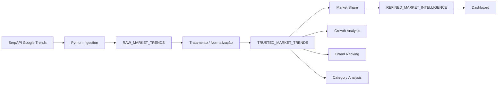

# Automotive Market Intelligence Platform

## Visão Geral

Plataforma de inteligência de mercado automotivo baseada em tendências de busca no mercado brasileiro.

O projeto simula uma arquitetura moderna de dados para análise de comportamento do consumidor automotivo, utilizando dados históricos de interesse digital para geração de insights estratégicos.

---

## Objetivo

Monitorar o interesse de mercado por:

- SUVs
- Sedans
- Hatchs
- Elétricos
- Caminhões

Permitindo análises como:

- Share de interesse
- Crescimento de marcas
- Tendências de mercado
- Comparação entre segmentos

---

## Arquitetura

---

## Camadas

### RAW

Dados históricos brutos coletados da API de tendências.

### TRUSTED

Tratamento de:

datas inválidas
valores nulos
padronização de categorias

### REFINED

Camada analítica contendo:

market share
ranking de marcas
crescimento percentual
tendências por segmento

---

## Categorias Monitoradas

### SUVs
- Jeep
- Toyota
- Volkswagen
- Honda
- Chevrolet

### Sedans
- Toyota
- Honda
- Hyundai
- Chevrolet
- Volkswagen

### Hatchs
- Fiat
- Volkswagen
- Hyundai
- Chevrolet
- Renault

### Elétricos
- BYD
- GWM
- Volvo
- Toyota Hybrid
- CAOA Chery

### Caminhões
- Scania
- Volvo Trucks
- Mercedes-Benz
- DAF
- Volkswagen Caminhões
---

## Tecnologias
- Python
- Pandas
- SerpAPI
- SQL
- Modelagem Medallion
---

## Insights Possíveis
- Crescimento de SUVs no mercado brasileiro
- Evolução do interesse por elétricos
- Comparativo entre marcas
- Tendências do segmento de caminhões
---

## 👨‍💻 Autor

Projeto desenvolvido com foco em engenharia de dados, analytics e inteligência de mercado.
